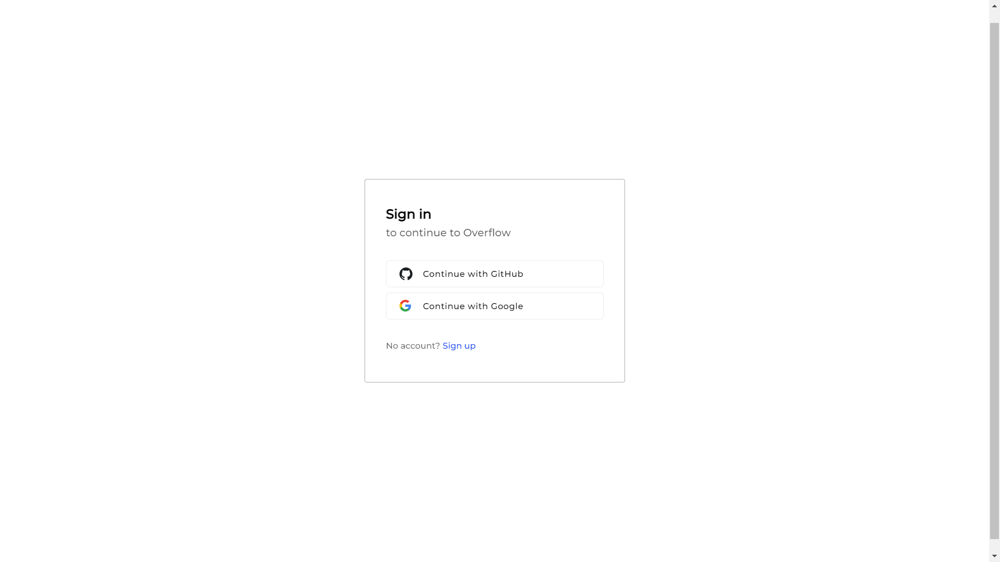

# Overflow - Question and Answer Platform

Overflow é uma plataforma moderna de perguntas e respostas, desenvolvida com o objetivo de facilitar o compartilhamento de conhecimento entre desenvolvedores e entusiastas da tecnologia. A plataforma oferece uma interface intuitiva, autenticação segura e uma experiência rápida e dinâmica.

## Tecnologias Utilizadas

- **Next.js**: Framework de React para construção de interfaces web rápidas e otimizadas.
- **Clerk Auth**: Sistema de autenticação completo e seguro, permitindo login, registro e gerenciamento de perfis de usuários.
- **NextUI**: Biblioteca de componentes para construção de interfaces modernas e responsivas.
- **MongoDB**: Banco de dados NoSQL utilizado para armazenar informações de usuários, perguntas, respostas e outros dados importantes da plataforma.

## Funcionalidades

- Autenticação de usuários (login e cadastro) via Clerk Auth
- Publicação e edição de perguntas
- Respostas a perguntas
- Sistema de votação (upvote/downvote) para perguntas e respostas
- Interface responsiva e amigável utilizando NextUI
- Integração com MongoDB para armazenamento de dados
- Filtro de perguntas por categorias e palavras-chave

## Como rodar o projeto localmente

### Pré-requisitos

- Node.js
- MongoDB
- Conta no Clerk para autenticação

### Passos

1. Clone este repositório:

   ```bash
   git clone https://github.com/Grazziano/overflow.git
   ```

2. Instale as dependências:

   ```bash
   cd overflow
   npm install
   ```

3. Configure as variáveis de ambiente:
   Crie um arquivo `.env.local` e adicione as chaves de API do Clerk, URL do MongoDB e outras configurações.

   ```
   NEXT_PUBLIC_CLERK_PUBLISHABLE_KEY=<sua_clerk_frontend_api>
   CLERK_SECRET_KEY=<sua_clerk_api_key>
   MONGO_URL=<sua_mongodb_uri>
   ```

4. Execute a aplicação:

   ```bash
   npm run dev
   ```

5. Acesse a aplicação em [http://localhost:3000](http://localhost:3000).

## Estrutura do Projeto

- `/app`: Páginas principais da aplicação.
- `/components`: Componentes reutilizáveis da interface.
- `/helpers`: Funções auxiliares e configuração do MongoDB.
- `/interfaces`: Interfaces da aplicação.
- `/models`: Models do MongoDB.
- `/providers`: Providers da aplicação.

## Imagens da Aplicação

Exemplos da interface de usuário.




## Contribuições

Contribuições são bem-vindas! Se você deseja melhorar esta plataforma, sinta-se à vontade para abrir uma issue ou enviar um pull request.

## Licença

Este projeto está licenciado sob a licença MIT. Veja o arquivo [LICENSE](LICENSE) para mais detalhes.
